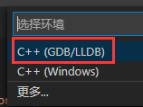
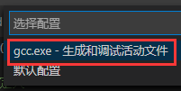

# C_Learn 学习笔记
最近打算重新学一遍C，故在此记录下笔记，不定时更新

使用说明

#### 运行环境
<table>
    <tbody>
        <tr>
            <td><b>编译器<b></td>
            <td>Mingw64</td>
        </tr>
        <tr>
            <td>
                <b>编辑器<b>
            </td>
            <td>
                VS Code
            </td>
        </tr>
    </tbody>
</table>

> 因为Visual Studio和Clion都对同一个项目里具有多个main方法不友好，需要把不需要运行的main方法去掉或修改配置，所以使用VS Code作为编辑器，VS Code可对单个文件运行

#### 运行
1. 安装Mingw64
2. VS Code配置好Mingw64
3. 拉取项目，用VS Code打开整个文件夹
4. 打开需要运行的.c文件，按F5，选择**C++(GDB/LLDB)**
5. 再选择**gcc.exe - 生成和调试活动文件**

 ———> 

#### 清除生成的文件 ！！慎用！！
脚本均在<kbd>_bat_script</kbd>文件夹内
1. 清除生成的exe文件
   运行<kbd>del_exe.bat</kbd>文件即可，会删除bat文件上一级目录下，包括子目录的所有exe文件
2. 清除vsvode生成的文件
   运行<kbd>del_vscode.bat</kbd>文件即可，会删除bat文件上一级目录下的<kbd>.vscode</kbd>文件夹
3. 清除exe和vsvode生成的文件
   运行<kbd>init.bat</kbd>文件即可

#### 笔记
- <a href="./pointer/C_Learn_Pointer.md">指针笔记</a>
