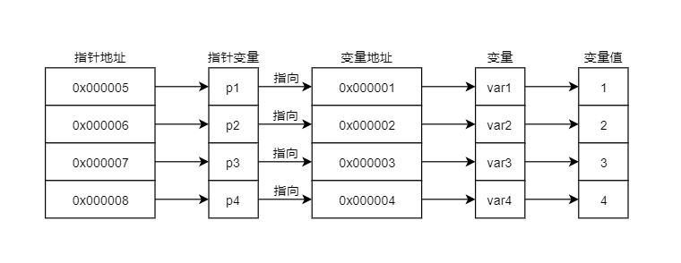

#   C_Learn_Pointer 指针学习笔记
  
- [C_Learn_Pointer 指针学习笔记](#c_learn_pointer-指针学习笔记)
  - [指针](#指针)
    - [指针的使用](#指针的使用)
      - [1. 指针->数组](#1-指针-数组)
      - [2. 指针数组](#2-指针数组)
      - [3. 数组指针](#3-数组指针)
  
##   指针
  
> 引申阅读:
> 1. [C 指针详解 | 菜鸟教程](https://www.runoob.com/w3cnote/c-pointer-detail.html )
  
* **指针是一个变量**，<kbd>保存(指向)</kbd>的是另一个变量的地址
* 数组变量保存的是第一个元素的地址
* 指针可以替代数组来使用，指针可以通过偏移量来模拟数组，但指针不等价于数组，因为指针也是一个变量，只是指向了一个变量的地址
* '&' 取当前变量的地址，'*'去当前变量的值
  
* **指针数组**：本质是一个数组，数组中的每一个元素都是一个指针，声明方法*p[10]
* **数组指针**：本质是一个指针，指向的是一个数组，具有固定的步长，每一步都跳过固定的长度，声明方法：(*p)[10]
> 1. 指针数组是一个数组，数组里面的元素都是指针，指向不同的变量的地址
> 2. 数组指针个人感觉更多和二维数组联系在一起，定义一个数组指针，步长为第二维数组的大小，指针指向的都是第二维数组
  
**注意事项：**
1. 指针指向int整数时，需要加&，整数包括int数组的元素：int *p= &x[2];
###   指针的使用
  
  
####  1. 指针->数组
  
   1. 输出对应的值：p[x]、*(p+x)
   2. 输出对应的地址：p、p+n
   3. **因为数组里的元素的地址是连续的，而指针是指向第一个元素的地址，所以在指针上+1或-1移动指针，可指向下一个或上一个数组元素**
```C
   printf("----------指针->数组----------\n");
   int x[10] = {1,2,3,4,5,6,7,8,9,0};
   int *p = x; // 指向第一个元素的地址
   printf("p address: %p\n", p); // 第一个元素的地址
   printf("*p: %d\n", *p); // 输出第一个元素
   printf("p[2]: %d\n", p[2]); // 输出第三个元素，使形式和数组一致，考虑之后不使用此形式，容易造成混淆
   printf("*(p+2): %d\n", *(p+2)); // 输出第三个元素
   printf("p[2] address: %p\n", p+2); // 输出第三个素的地址
   p+=2; // 移动指针，步长为2个int长度
   printf("p+=2->*p: %d\n", *p); // 输出跳过之后的第个元素
   printf("p+=2->p[2]: %d\n", p[2]);// 输出跳过之后第三个元素，使用形式和数组一致，考虑之后不使用此形式容易造成混淆
```
  
####  2. 指针数组
   <kbd>本质是一个数组，元素都是指针</kbd>

```C++
   printf("-----------指针数组-----------\n");
   int a[5] = {1,2,3,4,5};
   int *p_1[5]; // 指针数组
   int *p_1_a = a; // 一个指向数组的指针，指向的数组起始地址
   for(int i=0; i<5; i++){
      p_1[i] = &a[i]; // 将数组的各个元素指针指向一int
      printf("a[%d] val: %d address: %p\n" ,i ,a[i], &a[i]);
      printf("p_1_a[%d] val: %d address: %p\n" ,i ,*(p_1_a+i) ,p_1_a+i);
   }
   printf("\n");
   for(int i=0; i<5; i++){
      printf("p_1[%d] val: %d address: %p\n",i, *p_1[i], p_1[i]);
   }
```
> 和 int *p_1_a = a 的区别：
> 1. \*p_1_a = a是一个指针，指向的是数组的起始地址，因此可以用p_1_a[i] 或者\*(p_1_a+i)获取值
> 2. *p_1[5]是个数组，元素都是指针，因此p_1[i]为数组里的元素，是个指针，取值为\*p_1[i]，取地址为p_1[i]
  
####  3. 数组指针
   <kbd>本质是一个指针，指向一个数组</kbd>
   数组指针应该和二维数组会有比较多的联系
 

```C++
   int arr_2[2][3] = {{1,2,3},{5,6,7}};
   int (*pArr_2)[3]; // 声明一个指针，将指向一个一行拥有三个元素的数组
   pArr_2=arr_2;  // 指向一个二维数组

   printf("arr_2[0][0]: %d: %p\n",arr_2[0][0], &arr_2[0][0]); // 输出数组第一个元素及地址
   printf("*(pArr_2+0): %d: %p\n", **(pArr_2+0), *(pArr_2+0));

   printf("arr_2[1][1]: %d: %p\n",arr_2[1][1], &arr_2[1][1]); // 输出数组第二行的第二个元素及地址
   printf("*(pArr_2+1)+1: %d: %p\n", *(*(pArr_2+1)+1), *(pArr_2+1)+1);

   pArr_2++; // 前进一步，步长为3，跳过3个元素
   printf("---pArr_2前进一步\n");
   printf("*(pArr_2+0)+0: %d: %p\n", *(*(pArr_2+0)+0), *(pArr_2+0)+0); // 输出前进之后的输出数组第一个元素及地址
   printf("*(pArr_2+0)+1: %d: %p\n", *(*(pArr_2+0)+1), *(pArr_2+0)+1); // 输出前进之后的输出数组第二个元素及地址
```
  